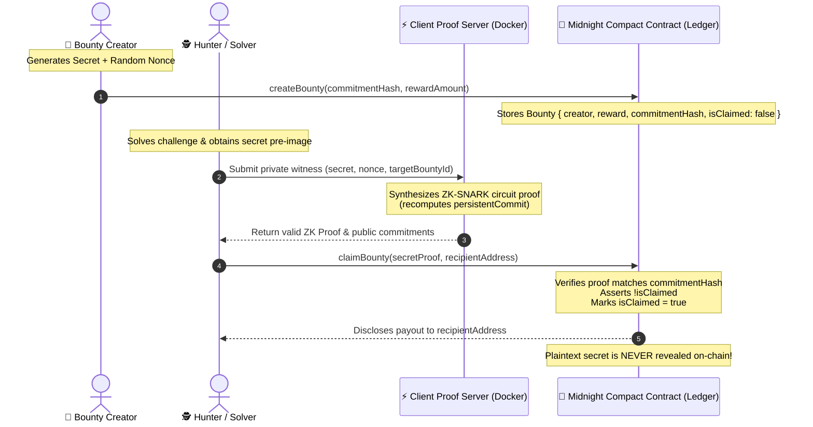

# 🌌 Midnight zk-Bounty

> **A decentralized, zero-knowledge bounty & challenge platform built on the [Midnight Network](https://midnight.network/).**

[](https://midnight.network/)
[](https://docs.midnight.network/)
[](https://nextjs.org/)
[](https://vitest.dev/)
[](LICENSE)

---

## 📖 Overview

**Midnight zk-Bounty** is a privacy-first smart contract and decentralized application (dApp) that enables trustless, anonymous bug bounties, cryptographic challenges, and puzzle rewards. 

In traditional platforms, claiming a bounty requires revealing the sensitive solution or pre-image to intermediaries or public ledgers. With **Midnight zk-Bounty**, solvers prove knowledge of the secret solution using **client-side Zero-Knowledge (ZK) proofs**. The Midnight smart contract validates the mathematical proof directly on-chain and releases the reward **without ever disclosing the plaintext secret**.

---

## 🏛️ Architecture & Zero-Knowledge Workflow

The protocol decouples public ledger state from private witness state using Midnight's Compact language and off-chain proof generation.



### Core Privacy Model
1. **Commitment Phase (Creator)**:
   - The creator defines a private secret $S$ and blinds it with a fresh random cryptographic nonce $N$.
   - The creator computes $C = \text{makeCommitment}(S, N) = \text{persistentCommit}(S, N)$ and submits $C$ along with the locked reward to `createBounty(commitment, reward)`.
   - The public ledger records `{ creator, rewardAmount, commitmentHash: C, isClaimed: false }`.
2. **Client-Side Proof Generation (Hunter / Solver)**:
   - When a solver discovers $S$, they load $S$ and $N$ into their local **Private State Witness** (`BountyPrivateState`).
   - The private witness is fed into the local Midnight Proof Server.
   - The circuit verifies that `persistentCommit(secret, nonce) == storedCommitmentHash` entirely within a zero-knowledge circuit boundary.
3. **On-Chain Validation & Settlement (Midnight Contract)**:
   - The transaction publishes only the re-blinded proof and the claimant's public payout address.
   - The contract verifies the transition constraints, transitions `isClaimed` to `true`, and dispatches the reward to `recipientAddress`.
   - **Soundness & Zero-Knowledge Guarantee**: Low-entropy secrets cannot be brute-forced due to the salted nonce, and no ledger observer can reconstruct the pre-image.

---

## 📂 Project Structure

```
midnight-zk-bounty/
├── contract/                             # Midnight Compact Smart Contract & Lifecycle Tests
│   ├── src/
│   │   ├── bounty.compact                # Compact smart contract (circuits, witnesses, ledger state)
│   │   ├── witnesses.ts                  # TypeScript private witness implementations
│   │   ├── index.ts                      # Module entrypoint re-exporting compiled bindings
│   │   ├── managed/                      # Compiler output generated by `compact compile` (gitignored)
│   │   └── test/
│   │       ├── bounty-simulator.ts       # Off-chain harness via @midnight-ntwrk/compact-runtime
│   │       └── bounty.test.ts            # Vitest lifecycle suite (creation, claims, double-claim & revert checks)
│   ├── package.json                      # Contract scripts & Compact runtime dependencies
│   ├── tsconfig.json                     # TypeScript configuration
│   └── vitest.config.ts                  # Vitest runner settings
│
├── frontend/                             # Modern High-Performance Next.js 15 App Router UI
│   ├── src/
│   │   ├── app/
│   │   │   ├── layout.tsx                # Next.js Root Layout, fonts, and dark mode configuration
│   │   │   └── page.tsx                  # Interactive ZK Dashboard, Protocol Visualizer, and bounty explorer
│   │   ├── components/
│   │   │   └── zk/                       # ZK modules (ZkProtocolVault, MidnightGlyph, ClaimModal, CreateBounty, Verifier, Header)
│   │   ├── lib/
│   │   │   └── zk.ts                     # Client-side ZK helpers, persistentCommit, and state types
│   │   └── styles.css                    # Obsidian Dark / Cyan / Violet / Neon Emerald Tailwind theme
│   ├── next.config.mjs                   # Next.js WASM & Webpack configuration
│   ├── package.json                      # Next.js 15 / React 19 dependencies
│   └── tsconfig.json                     # Next.js TypeScript configuration
│
└── README.md                             # Global Project Documentation
```

> [!NOTE]
> The frontend dApp is located in [`frontend/`](file:///c:/Users/efe/Desktop/midnight-zk-bounty/frontend), featuring an interactive **Zero-Knowledge Circuit & Escrow Vault Visualizer**, real-time witness synthesis simulator, 1AM/Midnight Lace wallet integration, and live ledger transaction streams.

---

## 🚀 Getting Started & Setup Guide

### 📋 Prerequisites

Ensure you have the following installed on your machine:
- **Node.js**: `v22.0.0` or higher
- **Docker & Docker Compose**: For running the local Midnight Proof Server
- **Midnight Compact Compiler CLI**: `compact` (`compact --version >= 0.22`)
- **Package Manager**: `npm`, `pnpm`, or `bun`

---

### Step 1: Start the Midnight Proof Server (Docker)

The Midnight proof server generates zk-SNARK proving keys and witness circuits off-chain.

Run the official Midnight Proof Server container locally:

```bash
# Pull and start the Midnight Proof Server on port 6300
docker run -d \
  --name midnight-proof-server \
  -p 6300:6300 \
  midnightntwrk/proof-server:latest
```

Verify that the server is responding:
```bash
curl http://localhost:6300/health || echo "Proof server is live"
```

---

### Step 2: Compile the Compact Smart Contract

Navigate to the `contract/` directory and compile [`bounty.compact`](file:///c:/Users/efe/Desktop/midnight-zk-bounty/contract/src/bounty.compact) to generate the managed TypeScript and circuit artifacts:

```bash
# Navigate to contract workspace
cd contract

# Install dependencies
npm install

# Compile the Compact contract into src/managed/bounty
npm run compact
```

*This invokes:*
```bash
compact compile src/bounty.compact src/managed/bounty
```

---

### Step 3: Run the Test Suite

The contract includes comprehensive lifecycle tests using `@midnight-ntwrk/compact-runtime` to verify ledger initialization, bounty creation, zero-knowledge claims, and revert assertions:

```bash
# Run unit & lifecycle tests
npm test

# Or compile and test in a single command
npm run test:compile
```

#### 🧪 Terminal Test Execution Output:

```text
C:\Users\efe\Desktop\midnight-zk-bounty\contract>npm test

> @midnight-zk-bounty/contract@0.1.0 test
> vitest run

 RUN  v3.2.7 C:/Users/efe/Desktop/midnight-zk-bounty/contract

 ✓ src/test/bounty.test.ts (5 tests) 17ms
   ✓ Midnight zk-Bounty lifecycle > initializes the ledger with an empty bounty map 9ms
   ✓ Midnight zk-Bounty lifecycle > creates a bounty committed to a hashed secret 3ms
   ✓ Midnight zk-Bounty lifecycle > claims a bounty with a valid proof generated from the secret pre-image 1ms
   ✓ Midnight zk-Bounty lifecycle > reverts the claim when the secret does not match the commitment 2ms
   ✓ Midnight zk-Bounty lifecycle > reverts a double claim of the same bounty 1ms

 Test Files  1 passed (1)
      Tests  5 passed (5)
   Start at  09:31:01
   Duration  364ms (transform 48ms, setup 0ms, collect 89ms, tests 17ms, environment 0ms, prepare 76ms)
```

#### Test Scenarios Covered:
- ✅ **Ledger Initialization**: Verifies constructor sets `nextBountyId = 0` and empty ledger map.
- ✅ **Bounty Creation**: Verifies that commitment hashes and reward amounts are accurately locked on-chain.
- ✅ **Valid ZK Claim**: Proves knowledge of private witness without exposing secret plaintext.
- ✅ **Invalid Secret Reversion**: Asserts that incorrect solutions fail circuit constraint checks (`invalid solution proof`).
- ✅ **Double-Claim Prevention**: Asserts that already-claimed bounties cannot be claimed again (`bounty already claimed`).

---

### Step 4: Run the Next.js Frontend UI (`frontend`)

Launch the Next.js client web application to interact with bounties, generate proofs, and test claims:

```bash
# Navigate to the frontend project
cd ../frontend

# Install dependencies
npm install

# Start the Next.js development server
npm run dev
```

Open [http://localhost:3000](http://localhost:3000) in your browser to view the dApp interface.

---

## 🔒 Smart Contract Specification & Token Economics

### Token Units
- **1 NIGHT** = `1,000,000` Stars / tDUST.
- All on-chain reward values in Compact are represented as `Uint<64>` (mapped to JavaScript `BigInt`).

### Ledger State (`bounty.compact`)

```typescript
struct Bounty {
    creator: Bytes32,
    rewardAmount: Uint<64>,
    commitmentHash: Bytes32,
    isClaimed: Boolean,
}

export ledger bounties: Map<Uint<64>, Bounty>;
export ledger nextBountyId: Uint<64>;
```

### Circuit Transitions

| Circuit | Access | Description |
| :--- | :--- | :--- |
| `createBounty(commitment, reward)` | Public | Registers a new bounty commitment on-chain, associating it with the sender's address. |
| `claimBounty(secretProof, recipientAddress)` | Private Witness + Public Proof | Evaluates private solution pre-image and nonce inside ZK circuit, verifies equality with `commitmentHash`, marks claimed, and records payout recipient. |

---

## 👥 Contributors & Task Distribution

This project was built during the Midnight Network development program:

### 🎨 **Fellow A**
- **Frontend Engineering & UI/UX**: Built the interactive Next.js 15 (App Router) web application in [`frontend/`](file:///c:/Users/efe/Desktop/midnight-zk-bounty/frontend) with React 19, custom `MidnightGlyph` cryptography iconography, `ZkProtocolVault` circuit visualizer, and Tailwind CSS.
- **Client-Side ZK State Integration**: Implemented client witness synthesis, `persistentCommit` simulation, and multi-stage proof transitions in [`ClaimModal.tsx`](file:///c:/Users/efe/Desktop/midnight-zk-bounty/frontend/src/components/zk/ClaimModal.tsx) and [`zk.ts`](file:///c:/Users/efe/Desktop/midnight-zk-bounty/frontend/src/lib/zk.ts).
- **System Documentation**: Authored complete architectural overviews, sequence diagrams, and integration documentation.

### ⚡ **Fellow B**
- **Midnight Compact Smart Contract**: Designed and implemented [`bounty.compact`](file:///c:/Users/efe/Desktop/midnight-zk-bounty/contract/src/bounty.compact) with persistent commitment circuits, ledger state mappings, and assertions.
- **Private Witness Handlers**: Implemented TypeScript private state bindings and witness context mappings in [`witnesses.ts`](file:///c:/Users/efe/Desktop/midnight-zk-bounty/contract/src/witnesses.ts).
- **Off-Chain Simulation & Testing**: Built the [`bounty-simulator.ts`](file:///c:/Users/efe/Desktop/midnight-zk-bounty/contract/src/test/bounty-simulator.ts) runtime harness and authored the full Vitest lifecycle test suite in [`bounty.test.ts`](file:///c:/Users/efe/Desktop/midnight-zk-bounty/contract/src/test/bounty.test.ts).

---

## 📄 License

This project is licensed under the **Apache License 2.0**. See the [LICENSE](LICENSE) file for details.